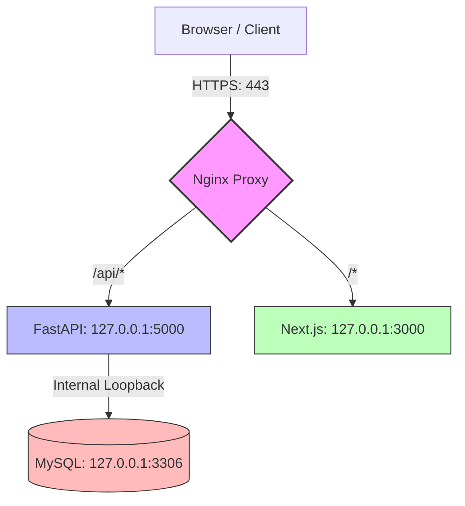

# Production Deployment Guide: Periyar Department Portal

This guide outlines the system configurations, services, reverse proxy setups, and firewall rules required to securely deploy the **Periyar Department Portal** in a production environment using a Same-Origin API strategy.

> [!IMPORTANT]
> - A **Reverse Proxy** (like Nginx) must be configured on the production server.
> - The firewall **must block all public access to backend port 5000** and other internal ports.
> - The browser's **Network tab should show only same-origin `/api` requests** (no absolute URLs pointing to a backend port).
> - The direct backend public URL **must be completely inaccessible** from the public internet.

---

## 1. Same-Origin Network Architecture

To prevent backend port leakage and browser network trace exposure, the frontend (Next.js) and backend (FastAPI) are hosted behind an **Nginx Reverse Proxy**. 

- The browser interacts exclusively with Nginx on port `80` (HTTP) or `443` (HTTPS).
- Nginx routes `/api/` traffic internally to FastAPI (`127.0.0.1:5000`).
- Nginx routes all other traffic `/` internally to Next.js (`127.0.0.1:3000`).
- The backend and database listen ONLY on `localhost`/private interfaces, never on the public internet.



---

## 2. Nginx Server Configuration

Save this file as `/etc/nginx/sites-available/periyar-portal` and symlink it to `/etc/nginx/sites-enabled/`.

```nginx
# Redirect HTTP to HTTPS
server {
    listen 80;
    listen [::]:80;
    server_name yourdomain.com www.yourdomain.com;
    return 301 https://$server_name$request_uri;
}

server {
    listen 443 ssl http2;
    listen [::]:443 ssl http2;
    server_name yourdomain.com www.yourdomain.com;

    # SSL Certificate Paths
    ssl_certificate /etc/letsencrypt/live/yourdomain.com/fullchain.pem;
    ssl_certificate_key /etc/letsencrypt/live/yourdomain.com/privkey.pem;
    
    # Modern SSL configuration
    ssl_protocols TLSv1.2 TLSv1.3;
    ssl_ciphers HIGH:!aNULL:!MD5;
    ssl_prefer_server_ciphers on;

    # Global proxy headers
    proxy_set_header Host $host;
    proxy_set_header X-Real-IP $remote_addr;
    proxy_set_header X-Forwarded-For $proxy_add_x_forwarded_for;
    proxy_set_header X-Forwarded-Proto $scheme;

    # 1. Frontend Proxy (Next.js)
    location / {
        proxy_pass http://127.0.0.1:3000;
        proxy_http_version 1.1;
        proxy_set_header Upgrade $http_upgrade;
        proxy_set_header Connection 'upgrade';
        proxy_cache_bypass $http_upgrade;
    }

    # 2. Backend API Proxy (FastAPI)
    location /api/ {
        proxy_pass http://127.0.0.1:5000;
        proxy_buffering off;
        
        # Enforce file size upload limit at the proxy level (e.g. 10M matches FastAPI config)
        client_max_body_size 10M;
    }
}
```

---

## 3. Systemd Service Configurations

To ensure frontend and backend run reliably in the background, create the following systemd service units.

### Backend: `/etc/systemd/system/periyar-backend.service`

```ini
[Unit]
Description=FastAPI Backend Service for Periyar Portal
After=network.target mysql.service

[Service]
Type=simple
User=deploy
WorkingDirectory=/var/www/periyar-dept-comp/backend
EnvironmentFile=/var/www/periyar-dept-comp/backend/.env
ExecStart=/var/www/periyar-dept-comp/backend/venv/bin/uvicorn main:app --host 127.0.0.1 --port 5000 --workers 4
Restart=always
RestartSec=5
StandardOutput=journal
StandardError=journal

[Install]
WantedBy=multi-user.target
```

### Frontend: `/etc/systemd/system/periyar-frontend.service`

```ini
[Unit]
Description=Next.js Frontend Service for Periyar Portal
After=network.target

[Service]
Type=simple
User=deploy
WorkingDirectory=/var/www/periyar-dept-comp/frontend
EnvironmentFile=/var/www/periyar-dept-comp/frontend/.env
ExecStart=/usr/bin/npm start
Restart=always
RestartSec=5
StandardOutput=journal
StandardError=journal

[Install]
WantedBy=multi-user.target
```

---

## 4. Build and Run Commands

Execute these steps on the production server to initialize and compile the application.

### Backend Setup
```bash
cd /var/www/periyar-dept-comp/backend

# Create virtual environment and install dependencies
python3 -m venv venv
source venv/bin/activate
pip install --upgrade pip
pip install -r requirements.txt

# Run migrations (FastAPI auto-upgrades Alembic schema on start as well)
# alembic upgrade head

# Start backend service
sudo systemctl daemon-reload
sudo systemctl enable periyar-backend
sudo systemctl start periyar-backend
```

### Frontend Setup
```bash
cd /var/www/periyar-dept-comp/frontend

# Install dependencies strictly matching package-lock
npm ci

# Build the production optimized NextJS bundle
npm run build

# Start frontend service
sudo systemctl enable periyar-frontend
sudo systemctl start periyar-frontend
```

---

## 5. Security & Firewall Checklist

Use `ufw` (Uncomplicated Firewall) on Ubuntu/Debian to secure your ports:

| Port | Protocol | Scope | Production Status | Action / Command |
|---|---|---|---|---|
| **80** | TCP | Public | **OPEN** | `sudo ufw allow 80/tcp` |
| **443** | TCP | Public | **OPEN** | `sudo ufw allow 443/tcp` |
| **3000** | TCP | Localhost | **CLOSED** | Exclude from UFW (internal proxy only) |
| **5000** | TCP | Localhost | **CLOSED** | Exclude from UFW (internal proxy only) |
| **3306** | TCP | Localhost | **CLOSED** | Exclude from UFW (internal proxy only) |

### Firewall Script Example
```bash
# Enable UFW and set default rules
sudo ufw default deny incoming
sudo ufw default allow outgoing

# Allow standard web access and SSH
sudo ufw allow 22/tcp comment 'SSH'
sudo ufw allow 80/tcp comment 'HTTP'
sudo ufw allow 443/tcp comment 'HTTPS'

# Enable firewall
sudo ufw enable
```

### Production Verification Command
To ensure ports `3000`, `5000`, and `3306` are only listening on localhost, run:
```bash
netstat -tulnp | grep -E '3000|5000|3306'
# Output should show 127.0.0.1:3000, 127.0.0.1:5000, and 127.0.0.1:3306 respectively.
```
