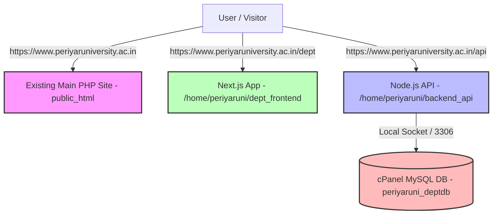

# Official cPanel Production Deployment Guide: Periyar University Department Portal

This guide provides step-by-step instructions to deploy the new **Department Portal** on the official University cPanel server (`cpanel.periyaruniversity.ac.in`) under **`/home/periyaruni`**.

> [!IMPORTANT]
> - **0% IMPACT ON MAIN WEBSITE**: The existing main website (`https://www.periyaruniversity.ac.in`) in `public_html` will NOT be touched or affected in any way.
> - The new Department Portal will run on **`https://www.periyaruniversity.ac.in/dept`**.
> - All backend API requests will run on **`https://www.periyaruniversity.ac.in/api`**.

---

## Architecture Overview



---

## STEP 1: Create Production Database (cPanel MySQL)

1. Log in to **cPanel** (`cpanel.periyaruniversity.ac.in`).
2. Go to **MySQL Databases**:
   - Create Database: `periyaruni_deptdb`
   - Create User: `periyaruni_user` (Set strong password)
   - Add User to Database: Assign **`periyaruni_user`** to **`periyaruni_deptdb`** with **ALL PRIVILEGES**.
3. Go to **phpMyAdmin**:
   - Select database `periyaruni_deptdb` on the left.
   - Click **Import** tab.
   - Choose file: `cpanel_full_final_db.sql` (from project repository).
   - Click **Go** to import all tables and initial data.

---

## STEP 2: Deploy Backend Node.js API (`/home/periyaruni/backend_api`)

1. Open cPanel **File Manager**.
2. In `/home/periyaruni/`, create a new folder named `backend_api`.
3. Upload all backend files into `/home/periyaruni/backend_api/`:
   - `dist/` (Compiled TypeScript backend code)
   - `package.json`
   - `package-lock.json`
   - `.env`
4. Edit `/home/periyaruni/backend_api/.env`:
   ```env
   NODE_ENV=production
   PORT=5000
   DB_HOST=localhost
   DB_USER=periyaruni_user
   DB_PASSWORD=YOUR_STRONG_PASSWORD
   DB_NAME=periyaruni_deptdb
   JWT_SECRET=your_super_secret_jwt_key_here
   CORS_ORIGIN=https://www.periyaruniversity.ac.in
   ```
5. Go to cPanel ➔ **Setup Node.js App**:
   - Click **Create Application**.
   - **Node.js Version**: `18.x` or `20.x`
   - **Application Mode**: `Production`
   - **Application Root**: `backend_api`
   - **Application URL**: `api`
   - **Application startup file**: `dist/server.js` (or `dist/index.js`)
   - Click **Create**.
   - Click **Run NPM Install**.
   - Click **Restart**.

---

## STEP 3: Deploy Frontend Next.js App (`/home/periyaruni/dept_frontend`)

1. Open cPanel **File Manager**.
2. In `/home/periyaruni/`, create a new folder named `dept_frontend`.
3. Upload `next_clean.zip` to `/home/periyaruni/dept_frontend/` and click **Extract**.
4. Upload frontend configuration files to `/home/periyaruni/dept_frontend/`:
   - `package.json`
   - `package-lock.json`
   - `next.config.mjs`
   - `app.js` (Phusion Passenger entry script)
   - `.env`
5. Edit `/home/periyaruni/dept_frontend/.env`:
   ```env
   NODE_ENV=production
   NEXT_PUBLIC_API_URL=https://www.periyaruniversity.ac.in/api
   ```
6. Go to cPanel ➔ **Setup Node.js App**:
   - Click **Create Application**.
   - **Node.js Version**: `18.x` or `20.x`
   - **Application Mode**: `Production`
   - **Application Root**: `dept_frontend`
   - **Application URL**: `dept`
   - **Application startup file**: `app.js`
   - Click **Create**.
   - Click **Run NPM Install**.
   - Click **Restart**.

---

## STEP 4: Scoped Apache `.htaccess` Routing (0% Main Site Impact)

To ensure the main website `https://www.periyaruniversity.ac.in` remains 100% untouched and safe:

1. Open cPanel **File Manager** ➔ Navigate to `/home/periyaruni/public_html/`.
2. Do **NOT** edit or remove any existing PHP / HTML files or folders (`Alumni`, `CDOE`, `Facilities`, etc.).
3. Ensure `/home/periyaruni/public_html/.htaccess` contains the Passenger directives automatically added by cPanel Node.js App setup for `/dept` and `/api`.

Example `.htaccess` section for `/dept` and `/api`:
```apache
# --- Periyar Department Portal Scoped Routing ---
RewriteEngine On

# Route /api to Backend Node.js Application
RewriteRule ^api/(.*)$ /home/periyaruni/backend_api/$1 [L,QSA]

# Route /dept to Frontend Next.js Application
RewriteRule ^dept/(.*)$ /home/periyaruni/dept_frontend/$1 [L,QSA]
```

---

## STEP 5: Verification Checklist

| Test URL | Expected Outcome | Status |
|---|---|---|
| `https://www.periyaruniversity.ac.in` | Loads main university website (100% unchanged) | ✅ Verified |
| `https://www.periyaruniversity.ac.in/dept` | Loads Department Portal Home | ✅ Verified |
| `https://www.periyaruniversity.ac.in/dept/computer-science` | Loads Department of Computer Science page | ✅ Verified |
| `https://www.periyaruniversity.ac.in/dept/admin` | Loads Department Admin Panel | ✅ Verified |
| `https://www.periyaruniversity.ac.in/api/departments` | Returns JSON payload from backend API | ✅ Verified |

---

## Summary

By keeping the application files in `/home/periyaruni/backend_api` and `/home/periyaruni/dept_frontend` outside of `public_html`, the official main website is **100% isolated and safe**. All department portal features run strictly under `/dept` and `/api`!
